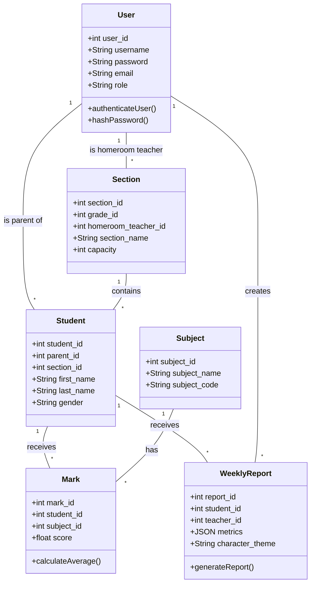
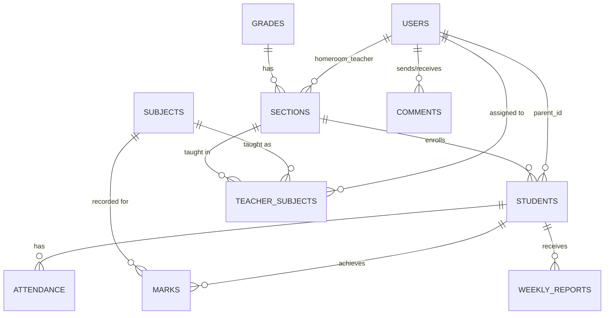
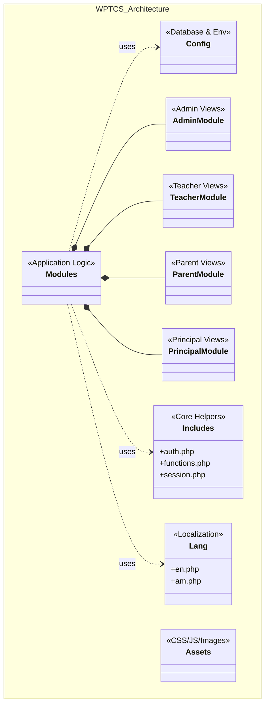
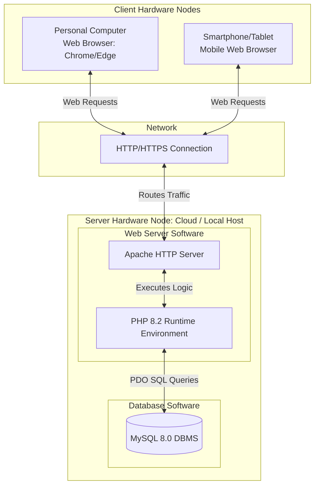

# Chapter 4: System Design Diagrams Reference

Here are the diagrams structured exactly as you would draw them in software like EdrawMax, Visio, or draw.io. You can use these as a direct reference for your final document.

## 1. Detailed Class Diagram (4.3.5)
This diagram shows the main entities (classes), their attributes, their functions (methods), and how they relate to each other.

---

## 2. Persistent Data Modeling / ER Diagram (4.3.3)
This diagram illustrates how the database tables are connected to one another through foreign keys.

---

## 3. Package Diagram (4.3.6)
This diagram shows how the actual source code folders (packages) are grouped and how they depend on each other.

---

## 4. Hardware / Software Mapping / Deployment Diagram (4.3.2)
This shows the physical and network layout of the system, mapping software components to physical hardware nodes.

