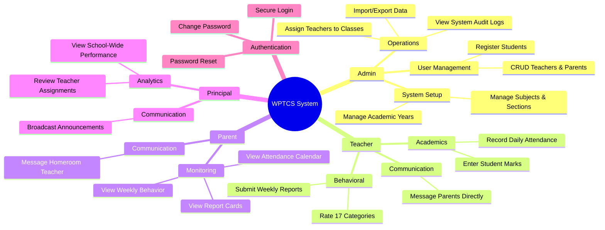
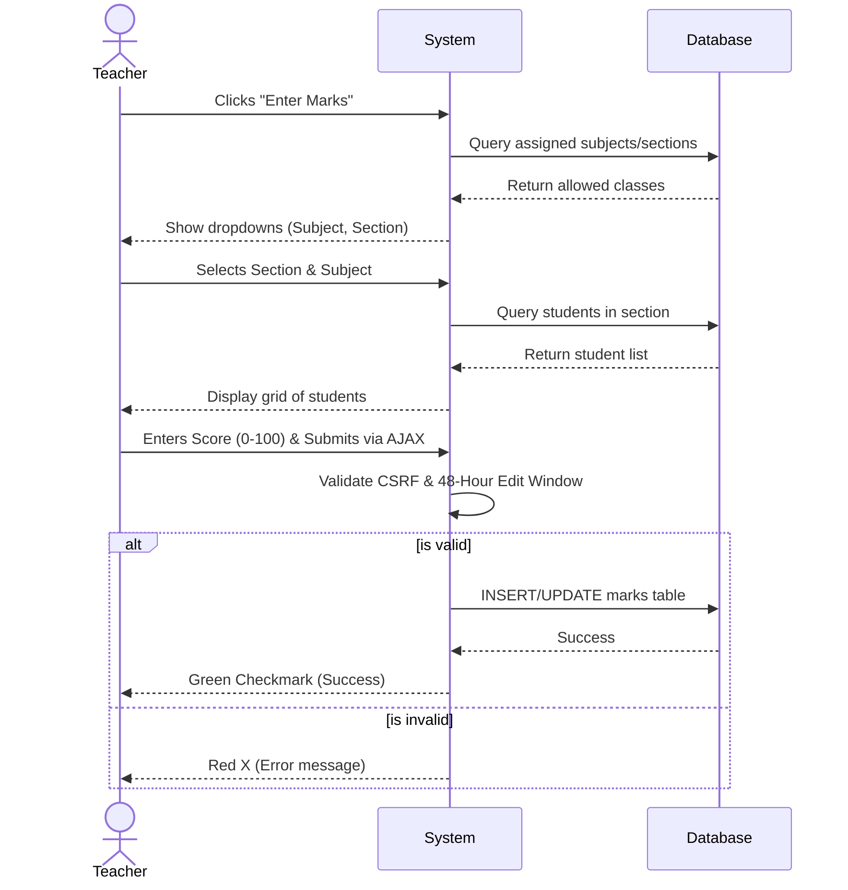

# System Workflows and Dependencies

This document provides detailed graphical diagrams representing all the major workflows in the WPTCS system, the roles involved, and the external resources/packages the system depends on.

## 1. Complete System Use Cases (Role-Based Workflows)
This diagram maps out every possible action each specific user role can perform within the system.



---

## 2. Authentication & Password Recovery Workflow
This activity diagram details the specific technical flow of how the system handles user authentication and the Composer PHPMailer password recovery.

```mermaid
flowchart TD
    Start([User opens Login Page]) --> Action{What does user do?}
    
    %% Login Flow
    Action -->|Enters Credentials| CheckActive{Account Active?}
    CheckActive -->|No| Reject1[Show: Account Inactive]
    CheckActive -->|Yes| CheckLock{Is Locked Out?}
    
    CheckLock -->|Yes| Reject2[Show: Try again later]
    CheckLock -->|No| VerifyPass{password_verify()}
    
    VerifyPass -->|Fails| AddAttempt[Increment failed attempts]
    AddAttempt --> CheckAttempt{Attempts > 5?}
    CheckAttempt -->|Yes| Lock[Lock account for 15 mins]
    CheckAttempt -->|No| Reject3[Show: Invalid Credentials]
    
    VerifyPass -->|Success| ResetAttempts[Reset failed attempts]
    ResetAttempts --> Session[Regenerate Secure Session]
    Session --> Route[Route to specific Dashboard based on Role]
    
    %% Forgot Password Flow
    Action -->|Clicks Forgot Password| EnterEmail[User enters email]
    EnterEmail --> FindUser{Email in DB?}
    FindUser -->|No| Reject4[Show: Account not found]
    FindUser -->|Yes| GenPass[Generate Random 8-char Password]
    GenPass --> Hash[Hash with BCrypt]
    Hash --> UpdateDB[(Save hash to DB)]
    UpdateDB --> SetupMail[Load vendor/autoload.php]
    SetupMail --> ConfigSMTP[Configure PHPMailer SMTP]
    ConfigSMTP --> SendEmail[/Send email with Username & Temp Password/]
    SendEmail --> RedirectLogin[Redirect back to login]
```

---

## 3. Teacher Core Workflow: Grading & Attendance
This sequence diagram shows the step-by-step process of how a teacher interacts with the system to enter data.



---

## 4. Resource & Package Dependency Graph
This component diagram shows exactly what external packages, libraries, and resources the PHP application relies on to function.

```mermaid
flowchart TD
    subgraph Client Browser
        UI[User Interface]
    end

    subgraph External CDNs (Frontend Dependencies)
        BS5[Bootstrap 5.3 CSS/JS]
        Icons[Bootstrap Icons 1.11]
        Fonts[Google Fonts: Inter & Noto Sans Ethiopic]
    end

    subgraph Web Server (Backend System)
        Core[WPTCS Core App]
        
        subgraph Composer Packages
            PHPMailer[phpmailer/phpmailer v7.0+]
            Autoload[vendor/autoload.php]
        end
        
        subgraph PHP Extensions
            PDO[PDO MySQL Extension]
            Session[PHP Native Sessions]
            BCrypt[Native Password Hashing]
        end
    end

    subgraph Data Tier
        DB[(MySQL Database)]
    end

    %% Frontend Connections
    UI -->|Uses for layout| BS5
    UI -->|Uses for icons| Icons
    UI -->|Uses for typography| Fonts
    UI <-->|AJAX / HTTP| Core

    %% Backend Connections
    Core -->|Loads dependencies| Autoload
    Autoload --> PHPMailer
    Core -->|Sends Emails| PHPMailer
    
    Core -->|Uses for Security| BCrypt
    Core -->|Manages state| Session
    Core -->|Database Abstraction| PDO
    
    PDO <-->|SQL Queries| DB
```
